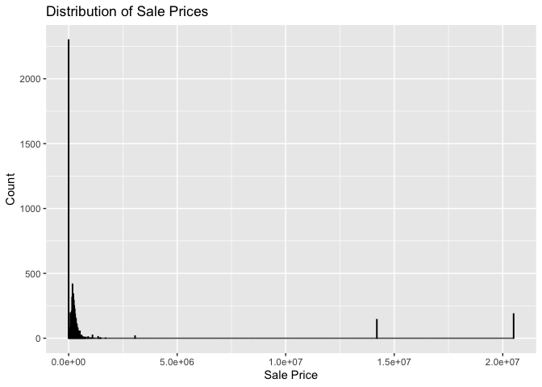

<!-- README.md is generated from README.Rmd. Please edit the README.Rmd file -->

# Lab \#2 Team \#11 - Report:

Follow the instructions posted at
<https://ds202-at-isu.github.io/labs.html> for the lab assignment. The
work is meant to be finished during the lab time, but you have time
until Monday evening to polish things.

Include your answers in this document (Rmd file). Make sure that it
knits properly (into the md file). Upload both the Rmd and the md file
to your repository.

All submissions to the github repo will be automatically uploaded for
grading once the due date is passed. Submit a link to your repository on
Canvas (only one submission per team) to signal to the instructors that
you are done with your submission.

|  |
|----|
| TL;DR Summary - Bhargav Yellepeddi: |
| The analysis of Ames property sales since 2017 shows most sales between \$100K–\$400K. Total living area follows a normal distribution, with outliers. A positive correlation exists between living area and sale price, though it weakens for larger properties. Missing data led to 447 rows being excluded. |

Bhargav Yellepeddi - SalePrice and Total Living Area Analysis:

``` r
# Load the Ames dataset
data <- classdata::ames
```

``` r
# View first few rows
head(data)
```

    ## # A tibble: 6 × 16
    ##   `Parcel ID` Address      Style Occupancy `Sale Date` `Sale Price` `Multi Sale`
    ##   <chr>       <chr>        <fct> <fct>     <date>             <dbl> <chr>       
    ## 1 0903202160  1024 RIDGEW… 1 1/… Single-F… 2022-08-12        181900 <NA>        
    ## 2 0907428215  4503 TWAIN … 1 St… Condomin… 2022-08-04        127100 <NA>        
    ## 3 0909428070  2030 MCCART… 1 St… Single-F… 2022-08-15             0 <NA>        
    ## 4 0923203160  3404 EMERAL… 1 St… Townhouse 2022-08-09        245000 <NA>        
    ## 5 0520440010  4507 EVERES… <NA>  <NA>      2022-08-03        449664 <NA>        
    ## 6 0907275030  4512 HEMING… 2 St… Single-F… 2022-08-16        368000 <NA>        
    ## # ℹ 9 more variables: YearBuilt <dbl>, Acres <dbl>,
    ## #   `TotalLivingArea (sf)` <dbl>, Bedrooms <dbl>,
    ## #   `FinishedBsmtArea (sf)` <dbl>, `LotArea(sf)` <dbl>, AC <chr>,
    ## #   FirePlace <chr>, Neighborhood <fct>

``` r
# Inspect the structure of the dataset
str(data)
```

    ## tibble [6,935 × 16] (S3: tbl_df/tbl/data.frame)
    ##  $ Parcel ID            : chr [1:6935] "0903202160" "0907428215" "0909428070" "0923203160" ...
    ##  $ Address              : chr [1:6935] "1024 RIDGEWOOD AVE, AMES" "4503 TWAIN CIR UNIT 105, AMES" "2030 MCCARTHY RD, AMES" "3404 EMERALD DR, AMES" ...
    ##  $ Style                : Factor w/ 12 levels "1 1/2 Story Brick",..: 2 5 5 5 NA 9 5 5 5 5 ...
    ##  $ Occupancy            : Factor w/ 5 levels "Condominium",..: 2 1 2 3 NA 2 2 1 2 2 ...
    ##  $ Sale Date            : Date[1:6935], format: "2022-08-12" "2022-08-04" ...
    ##  $ Sale Price           : num [1:6935] 181900 127100 0 245000 449664 ...
    ##  $ Multi Sale           : chr [1:6935] NA NA NA NA ...
    ##  $ YearBuilt            : num [1:6935] 1940 2006 1951 1997 NA ...
    ##  $ Acres                : num [1:6935] 0.109 0.027 0.321 0.103 0.287 0.494 0.172 0.023 0.285 0.172 ...
    ##  $ TotalLivingArea (sf) : num [1:6935] 1030 771 1456 1289 NA ...
    ##  $ Bedrooms             : num [1:6935] 2 1 3 4 NA 4 5 1 3 4 ...
    ##  $ FinishedBsmtArea (sf): num [1:6935] NA NA 1261 890 NA ...
    ##  $ LotArea(sf)          : num [1:6935] 4740 1181 14000 4500 12493 ...
    ##  $ AC                   : chr [1:6935] "Yes" "Yes" "Yes" "Yes" ...
    ##  $ FirePlace            : chr [1:6935] "Yes" "No" "No" "No" ...
    ##  $ Neighborhood         : Factor w/ 42 levels "(0) None","(13) Apts: Campus",..: 15 40 19 18 6 24 14 40 13 23 ...

``` r
unique(data[,"Sale Price"])
```

    ## # A tibble: 1,327 × 1
    ##    `Sale Price`
    ##           <dbl>
    ##  1       181900
    ##  2       127100
    ##  3            0
    ##  4       245000
    ##  5       449664
    ##  6       368000
    ##  7       110000
    ##  8       350000
    ##  9       242000
    ## 10       293000
    ## # ℹ 1,317 more rows

``` r
# Histogram of SalePrice
 ggplot(data, aes(x = `Sale Price`)) +
   geom_histogram(binwidth = 20000, fill = 'blue', color = 'black') +   
   labs(title = "Distribution of Sale Prices", x = "Sale Price", y = "Count")
```

<!-- -->

``` r
# Summary statistics of TotalLivingArea
summary(data$`TotalLivingArea (sf)`)
```

    ##    Min. 1st Qu.  Median    Mean 3rd Qu.    Max.    NA's 
    ##       0    1095    1460    1507    1792    6007     447

``` r
# Histogram of TotalLivingArea
ggplot(data, aes(x = `TotalLivingArea (sf)`)) +
  geom_histogram(binwidth = 100, fill = 'green', color = 'black') +
  labs(title = "Distribution of Ground Living Area", x = "Ground Living Area (sq ft)", y = "Count")
```

    ## Warning: Removed 447 rows containing non-finite outside the scale range
    ## (`stat_bin()`).

<!-- -->

``` r
# Scatterplot of SalePrice vs TotalLivingArea
ggplot(data, aes(x = `TotalLivingArea (sf)`, y = `Sale Price`)) +
  geom_point(color = 'purple') +
  labs(title = "Sale Price vs Ground Living Area", x = "Ground Living Area (sq ft)", y = "Sale Price")
```

    ## Warning: Removed 447 rows containing missing values or values outside the scale
    ## range (`geom_point()`).

## <!-- -->
