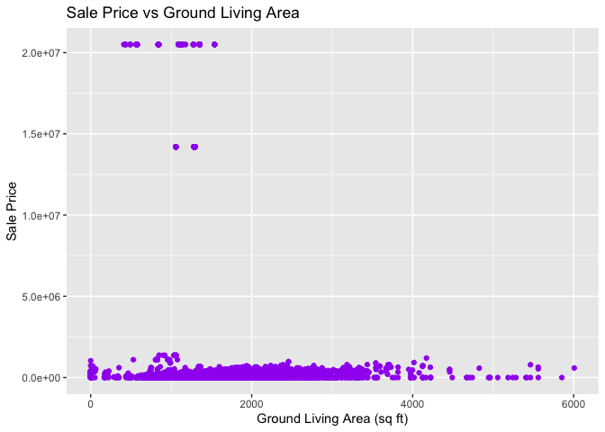

# Lab \#2 Team \#11 - Report:

Follow the instructions posted at
<https://ds202-at-isu.github.io/labs.html> for the lab assignment. The
work is meant to be finished during the lab time, but you have time
until Monday evening to polish things.

Include your answers in this document (Rmd file). Make sure that it
knits properly (into the md file). Upload both the Rmd and the md file
to your repository.

All submissions to the github repo will be automatically uploaded for
grading once the due date is passed. Submit a link to your repository on
Canvas (only one submission per team) to signal to the instructors that
you are done with your submission.

<<<<<<< HEAD
|                                                                                                                                                                                                                                                                                                                |
|----------------------------------------------------------------------------------------------------------------------------------------------------------------------------------------------------------------------------------------------------------------------------------------------------------------|
| TL;DR Summary - Bhargav Yellepeddi:                                                                                                                                                                                                                                                                            |
| The analysis of Ames property sales since 2017 shows most sales between \$100K–\$400K. Total living area follows a normal distribution, with outliers. A positive correlation exists between living area and sale price, though it weakens for larger properties. Missing data led to 447 rows being excluded. |
=======
    TL;DR Summary - Bhargav Yellepeddi:

    The analysis of Ames property sales since 2017 shows most sales between $100K–$400K. Total living area follows a normal distribution, with outliers. A positive correlation exists between living area and sale price, though it weakens for larger properties. Missing data led to 447 rows being excluded.

    TL;DR Summary - Keenan Jacobs:

    In this analysis, we explore the relationship between property size (Acres) and sale price (Sale Price). We find that larger properties tend to have higher sale prices on average. However, there are some properties with large acreage that have surprisingly low sale prices, which could be due to factors such as location, property condition, or zoning regulations.

Keenan Jacobs - SalePrice and Acres
>>>>>>> ca7ece837b2724149161e68e0bc46b542e384842

Bhargav Yellepeddi - SalePrice and Total Living Area Analysis:

``` r
# Load the Ames dataset
data <- classdata::ames
```

``` r
# View first few rows
head(data)
```

    ## # A tibble: 6 × 16
    ##   `Parcel ID` Address                       Style         Occupancy `Sale Date` `Sale Price` `Multi Sale` YearBuilt Acres `TotalLivingArea (sf)` Bedrooms FinishedBsmtArea (sf…¹ `LotArea(sf)` AC    FirePlace Neighborhood
    ##   <chr>       <chr>                         <fct>         <fct>     <date>             <dbl> <chr>            <dbl> <dbl>                  <dbl>    <dbl>                  <dbl>         <dbl> <chr> <chr>     <fct>       
    ## 1 0903202160  1024 RIDGEWOOD AVE, AMES      1 1/2 Story … Single-F… 2022-08-12        181900 <NA>              1940 0.109                   1030        2                     NA          4740 Yes   Yes       (28) Res: B…
    ## 2 0907428215  4503 TWAIN CIR UNIT 105, AMES 1 Story Frame Condomin… 2022-08-04        127100 <NA>              2006 0.027                    771        1                     NA          1181 Yes   No        (55) Res: D…
    ## 3 0909428070  2030 MCCARTHY RD, AMES        1 Story Frame Single-F… 2022-08-15             0 <NA>              1951 0.321                   1456        3                   1261         14000 Yes   No        (32) Res: C…
    ## 4 0923203160  3404 EMERALD DR, AMES         1 Story Frame Townhouse 2022-08-09        245000 <NA>              1997 0.103                   1289        4                    890          4500 Yes   No        (31) Res: M…
    ## 5 0520440010  4507 EVEREST  AVE, AMES       <NA>          <NA>      2022-08-03        449664 <NA>                NA 0.287                     NA       NA                     NA         12493 No    No        (19) Res: N…
    ## 6 0907275030  4512 HEMINGWAY DR, AMES       2 Story Frame Single-F… 2022-08-16        368000 <NA>              1996 0.494                   2223        4                     NA         21533 Yes   Yes       (37) Res: C…
    ## # ℹ abbreviated name: ¹​`FinishedBsmtArea (sf)`

``` r
# Inspect the structure of the dataset
str(data)
```

    ## tibble [6,935 × 16] (S3: tbl_df/tbl/data.frame)
    ##  $ Parcel ID            : chr [1:6935] "0903202160" "0907428215" "0909428070" "0923203160" ...
    ##  $ Address              : chr [1:6935] "1024 RIDGEWOOD AVE, AMES" "4503 TWAIN CIR UNIT 105, AMES" "2030 MCCARTHY RD, AMES" "3404 EMERALD DR, AMES" ...
    ##  $ Style                : Factor w/ 12 levels "1 1/2 Story Brick",..: 2 5 5 5 NA 9 5 5 5 5 ...
    ##  $ Occupancy            : Factor w/ 5 levels "Condominium",..: 2 1 2 3 NA 2 2 1 2 2 ...
    ##  $ Sale Date            : Date[1:6935], format: "2022-08-12" "2022-08-04" "2022-08-15" "2022-08-09" ...
    ##  $ Sale Price           : num [1:6935] 181900 127100 0 245000 449664 ...
    ##  $ Multi Sale           : chr [1:6935] NA NA NA NA ...
    ##  $ YearBuilt            : num [1:6935] 1940 2006 1951 1997 NA ...
    ##  $ Acres                : num [1:6935] 0.109 0.027 0.321 0.103 0.287 0.494 0.172 0.023 0.285 0.172 ...
    ##  $ TotalLivingArea (sf) : num [1:6935] 1030 771 1456 1289 NA ...
    ##  $ Bedrooms             : num [1:6935] 2 1 3 4 NA 4 5 1 3 4 ...
    ##  $ FinishedBsmtArea (sf): num [1:6935] NA NA 1261 890 NA ...
    ##  $ LotArea(sf)          : num [1:6935] 4740 1181 14000 4500 12493 ...
    ##  $ AC                   : chr [1:6935] "Yes" "Yes" "Yes" "Yes" ...
    ##  $ FirePlace            : chr [1:6935] "Yes" "No" "No" "No" ...
    ##  $ Neighborhood         : Factor w/ 42 levels "(0) None","(13) Apts: Campus",..: 15 40 19 18 6 24 14 40 13 23 ...

``` r
unique(data[,"Sale Price"])
```

    ## # A tibble: 1,327 × 1
    ##    `Sale Price`
    ##           <dbl>
    ##  1       181900
    ##  2       127100
    ##  3            0
    ##  4       245000
    ##  5       449664
    ##  6       368000
    ##  7       110000
    ##  8       350000
    ##  9       242000
    ## 10       293000
    ## # ℹ 1,317 more rows

``` r
# Histogram of SalePrice
 ggplot(data, aes(x = `Sale Price`)) +
   geom_histogram(binwidth = 20000, fill = 'blue', color = 'black') +   
   labs(title = "Distribution of Sale Prices", x = "Sale Price", y = "Count")
```

<!-- -->

``` r
# Summary statistics of TotalLivingArea
summary(data$`TotalLivingArea (sf)`)
```

    ##    Min. 1st Qu.  Median    Mean 3rd Qu.    Max.    NA's 
    ##       0    1095    1460    1507    1792    6007     447

``` r
# Histogram of TotalLivingArea
ggplot(data, aes(x = `TotalLivingArea (sf)`)) +
  geom_histogram(binwidth = 100, fill = 'green', color = 'black') +
  labs(title = "Distribution of Ground Living Area", x = "Ground Living Area (sq ft)", y = "Count")
```

    ## Warning: Removed 447 rows containing non-finite outside the scale range (`stat_bin()`).

<!-- -->

``` r
# Scatterplot of SalePrice vs TotalLivingArea
ggplot(data, aes(x = `TotalLivingArea (sf)`, y = `Sale Price`)) +
  geom_point(color = 'purple') +
  labs(title = "Sale Price vs Ground Living Area", x = "Ground Living Area (sq ft)", y = "Sale Price")
```

<<<<<<< HEAD
    ## Warning: Removed 447 rows containing missing values or values outside the scale range (`geom_point()`).

<!-- -->

------------------------------------------------------------------------

------------------------------------------------------------------------

Thien Tam Nguyen - SalePrice and LotArea Analysis:

1\.

“Sale Price”: A numeric variable representing the selling price of each
property. This variable ranges from low-value properties to luxury ones,
generally from around \$50,000 to over \$20 million as seen in the
histogram.

“Lot Area (sf)”: A numeric variable representing the size of the
property lot in square feet. The Lot Area ranges from small plots (less
than 10,000 square feet) to very large areas exceeding 500,000 square
feet.

Both variables are continuous, and they provide insight into the
property values and the physical size of the lots.

2.  I am taking analysis of sale price and lotArea

3.  The Sale Price histogram shows that the majority of properties are
    sold for prices under \$5 million, with most sales clustered around
    lower price points.There are a few extremely high sale prices (over
    \$15 million), which could indicate unique or luxury properties.The
    pattern shows that the market for properties in Ames is mostly
    concentrated in the lower price range, with a small number of
    high-value outliers.

4.  The Sale Price has a wide range, but most properties are
    concentrated in the lower value range, with some significant
    outliers.The Lot Area is also skewed, with most properties being
    small to medium-sized, but a few very large properties exist.There
    is a general positive trend between Lot Area and Sale Price, but the
    relationship is not perfectly linear, and other factors such as
    location or house features may play a crucial role.

``` r
# Load Ames dataset
data <- classdata::ames
```

``` r
# View first few rows for relevant columns with corrected names
colnames(data)
```

    ##  [1] "Parcel ID"             "Address"               "Style"                 "Occupancy"             "Sale Date"             "Sale Price"            "Multi Sale"            "YearBuilt"            
    ##  [9] "Acres"                 "TotalLivingArea (sf)"  "Bedrooms"              "FinishedBsmtArea (sf)" "LotArea(sf)"           "AC"                    "FirePlace"             "Neighborhood"

``` r
head(data[, c("Sale Price", "LotArea(sf)")])
```

    ## # A tibble: 6 × 2
    ##   `Sale Price` `LotArea(sf)`
    ##          <dbl>         <dbl>
    ## 1       181900          4740
    ## 2       127100          1181
    ## 3            0         14000
    ## 4       245000          4500
    ## 5       449664         12493
    ## 6       368000         21533

``` r
# Inspect structure to understand data types of specific columns
str(data[, c("Sale Price", "LotArea(sf)")])
```

    ## tibble [6,935 × 2] (S3: tbl_df/tbl/data.frame)
    ##  $ Sale Price : num [1:6935] 181900 127100 0 245000 449664 ...
    ##  $ LotArea(sf): num [1:6935] 4740 1181 14000 4500 12493 ...

``` r
# Histogram of Lot Area
ggplot(data, aes(x = `LotArea(sf)`)) +
  geom_histogram(binwidth = 1000, fill = 'orange', color = 'red') +
  labs(title = "Distribution of Lot Area in Ames Properties", 
       x = "Lot Area (square feet)", 
       y = "Count")
```

    ## Warning: Removed 89 rows containing non-finite outside the scale range (`stat_bin()`).

<!-- -->

``` r
#Scatterplot of Sale Price vs Lot Area in Ames Properties
ggplot(data, aes(x = `LotArea(sf)`, y = `Sale Price`)) +
  geom_point(color = 'darkgreen') +
  labs(title = "Sale Price vs Lot Area in Ames Properties", 
       x = "Lot Area (square feet)", 
       y = "Sale Price ($)")
```

    ## Warning: Removed 89 rows containing missing values or values outside the scale range (`geom_point()`).

<!-- -->

The scatter plot of Sale Price vs Lot Area shows a positive
relationship, indicating that larger lot sizes generally lead to higher
sale prices. However, there are many points with large lot areas and
lower-than-expected sale prices, implying that other factors may be
influencing the value.

``` r
# Scatterplot with trend line
ggplot(data, aes(x = `LotArea(sf)`, y = `Sale Price`)) +
  geom_point(color = 'darkblue') +
  geom_smooth(method = "lm", color = 'red', se = FALSE) +
  labs(title = "Sale Price vs Lot Area with Trend Line", 
       x = "Lot Area (square feet)", 
       y = "Sale Price ($)")
```

    ## `geom_smooth()` using formula = 'y ~ x'

    ## Warning: Removed 89 rows containing non-finite outside the scale range (`stat_smooth()`).

    ## Warning: Removed 89 rows containing missing values or values outside the scale range (`geom_point()`).

<!-- -->

The scatter plot with the **trend line** shows a downward slope, which
could indicate that there isn’t a straightforward, consistent linear
relationship between **Lot Area** and **Sale Price** for all properties.
This suggests variability and possibly the influence of other
characteristics.

``` r
# Histogram of Sale Price
ggplot(data, aes(x = `Sale Price`)) +
  geom_histogram(binwidth = 25000, fill = 'skyblue', color = 'black') +
  labs(title = "Distribution of Sale Prices in Ames Properties", 
       x = "Sale Price ($)", 
       y = "Count")
```

## <!-- -->
=======
    ## Warning: Removed 447 rows containing missing values or values outside the scale range
    ## (`geom_point()`).

<!-- -->

Keenan Jacobs and Analysis of Acres

``` r
summary(data$Acres)
```

    ##    Min. 1st Qu.  Median    Mean 3rd Qu.    Max.    NA's 
    ##  0.0000  0.1502  0.2200  0.2631  0.2770 12.0120      89

The range shows a semi-wide distribution, with most properties having a
small land size. Let’s visualize this distribution using a histogram.

``` r
# Histogram of Acres
ggplot(data, aes(x = Acres)) + 
  geom_histogram(binwidth = 0.1, fill = 'steelblue', color = 'black') +
  labs(title = 'Distribution of Property Size (Acres)', x = 'Acres', y = 'Frequency')
```

    ## Warning: Removed 89 rows containing non-finite outside the scale range
    ## (`stat_bin()`).

<!-- -->

``` r
# Scatterplot of Acres vs Sale Price
ggplot(data, aes(x = Acres, y = `Sale Price`)) + 
  geom_point(alpha = 0.5, color = 'darkgreen') +
  labs(title = 'Scatterplot of Property Size vs Sale Price', x = 'Acres', y = 'Sale Price ($)')
```

    ## Warning: Removed 89 rows containing missing values or values outside the scale range
    ## (`geom_point()`).

<!-- -->

Here we can see there is a few huge outliers so we should probably
filter them out and look again out our data as well as look at our
outliers.

``` r
# Filter properties with high Acres but low Sale Price

anomalies <- data %>% filter(Acres > 1, `Sale Price` < 50000)
filtered_data <- data %>%
  filter((Acres < 5 & `Sale Price` < 500000))
```

``` r
# Boxplot of Anomalies by Style
ggplot(anomalies, aes(x = Style, y = `Sale Price`)) + 
  geom_boxplot(fill = 'lightgreen', color = 'darkgreen') +
  coord_flip() +  # Flip coordinates for better readability
  labs(title = 'Distribution of Sale Prices for Anomalies by Style', 
       x = 'Property Style', 
       y = 'Sale Price ($)') +
  theme_minimal()
```

<!-- -->

``` r
# Plotting the filtered data to confirm anomalies have been removed
ggplot(filtered_data, aes(x = Acres, y = `Sale Price`)) +
  geom_point(alpha = 0.5, color = 'darkgreen') +
  labs(title = 'Scatterplot of Property Size vs Sale Price (Filtered Data)', 
       x = 'Acres', y = 'Sale Price ($)')
```

<!-- -->

Here we can see a few points of data looking at the anomolies and also
looking at the cleaned data. From the filtered data, we cna see that
there is little correlation between acre size and sales price.
>>>>>>> ca7ece837b2724149161e68e0bc46b542e384842
